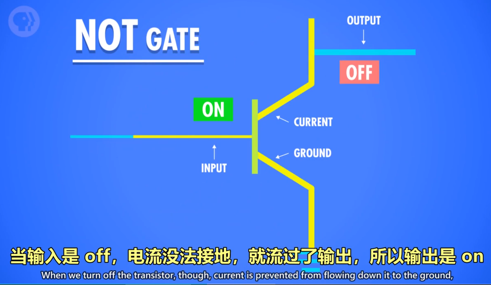
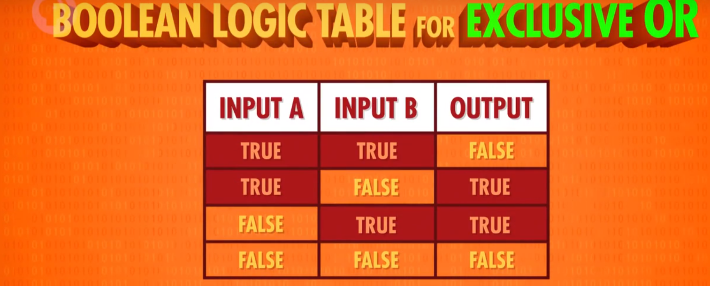
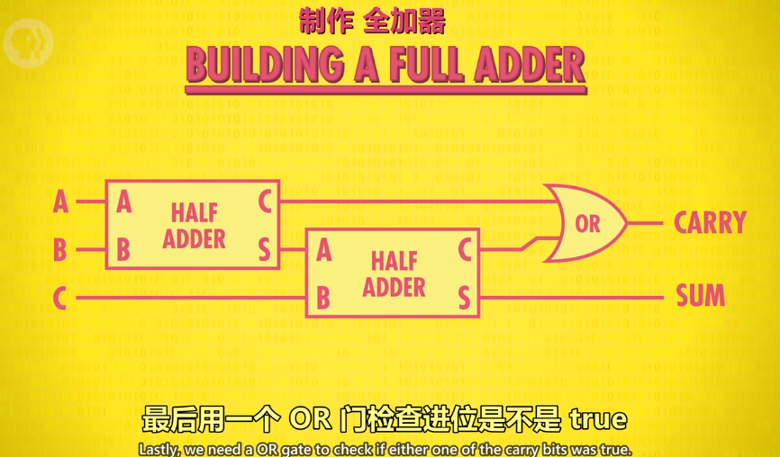
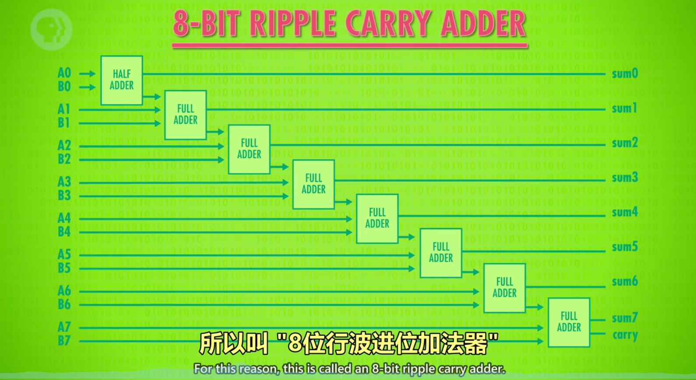
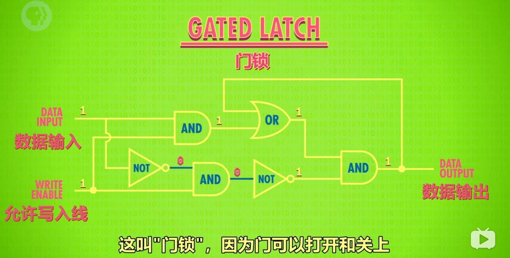
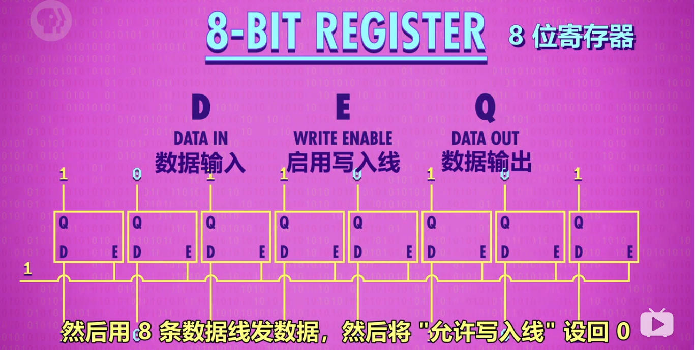

# Crash Course Computer Science

参考笔记：[https://shimo.im/docs/vkCKkj3YxGtygrVg/read](https://shimo.im/docs/vkCKkj3YxGtygrVg/read)
[https://shimo.im/docs/PJAUY30F1uYksv0h/read](https://shimo.im/docs/PJAUY30F1uYksv0h/read)

## 第 1 集：计算机早期历史

提到的设备：算盘 → 步进计算器 → 差分机 → 分析机 → 打孔卡片制表机 
提到的人名：Charles Babbage, Ada Lovelace

02:27 最早的计算设备是算盘，举例如何使用 
04:31 Computer 从指代职业变成指代机器 
04:57 机器里有名的是：步进计算器。第一个可以做加减乘除的机器
06:44 炮弹为了精准，要计算弹道，二战是查表来做。但每次改设计了就需要做一张新表
07:30 Charles Babbage 提出了 差分机, 在构造差分机期间，想出了分析机, 分析机是通用计算机 
08:50 Lovelace 给分析机写了假想程序，因此成为了第一位程序员 
09:25 人口普查 10 年一次. Herman Hollerith 的打孔卡片制表机大大提升了效率

### 0、课程目标：

从高层次总览一系列计算机话题，快速入门计算机科学。

### 1、计算机技术的影响——进入信息时代

- 出现自动化农业设备与医疗设备
- 全球通信和全球教育机会变得普遍
- 出现意想不到的虚拟现实/无人驾驶/人工智能等新领域

### 2、计算机的实质：

极其简单的组件，通过一层层的抽象，来做出复杂的操作。

计算机中的很多东西，底层其实都很简单，让人难以理解的，是一层层精妙的抽象。像一个越来越小的俄罗斯套娃。

### 3、关于计算的历史：

1. 公元前2500年，**算盘**出现，为十进制，功能类似一个计数器。
2. 公元前2500年-公元1500年：星盘、计算尺等依靠**机械**运动的计算设备出现
3. 公元1613年：computer的概念出现，当时指的是专门做计算的职业，
4. 1694年：**步进计算器**出现，是世界上第一台能自动完成加减乘除的计算器。
5. 1694-1900年：**计算表**兴起，类似于字典，可用于查找各种庞大的计算值。
6. 1823年：**差分机**的设想出现，可以做函数计算，但计划最后失败。
7. 19世纪中期：**分析机**的设想出现，设想存在可计算一切的通用计算机。
8. 1890年：**打孔卡片制表机**。原理：在纸上打孔→孔穿过针→针泡入汞→电路连通→齿轮使计数+1。

## 第 2 集：电子计算机

提到的设备：继电器 → 真空管 → 晶体管

00:17 20世纪的发展要求更强的计算能力。柜子大小的计算机发展到房间大小  
01:06 哈佛 Mark 1 号，IBM 1944 年做的  
02:25 继电器，继电器一秒最多 50 次开关  
03:24 继电器出 bug  
03:49 1904 年，热电子管出现，第一个真空管。改进后变成和继电器的功能一样  
05:34 "巨人1号" 计算机在英国 布莱切利园 首次大规模使用真空管。但编程麻烦，还要配置  
06:40 1946 年，宾夕法尼亚大学的 ENIAC 是第一个通用可编程计算机  
07:36 1947 年，贝尔实验室做出了晶体管，晶体管有诸多好处，IBM 很快全面转向晶体管  
09:27 硅谷的典故：很多晶体管和半导体的开发都是这里做的。而生产半导体最常见的材料是硅  
09:41 肖克利半导体 → 仙童半导体 → 英特尔

### 1、电子计算机元器件变化：

**继电器→真空管→晶体管**

### 2、计算机的出现背景：

20世纪人口暴增，科学与工程进步迅速，航天计划成形。以上导致数据的复杂度急剧上升、计算量暴增，对于计算的自动化、高速有迫切的需求。

### 3、电子计算机的发展：

1945年 哈佛马克1：使用**继电器**，用电磁效应，控制机械开关，缺点为有磨损和延迟。
*最早还因为有虫子飞进去导致故障，引申出bug=故障的意思。

1943年 巨人1号：使用**真空管（三极管）**，制造出世界上第一个可编程的计算机。

1946年 ENIAC：第一个电子数值积分计算机，为第一台通用计算机。

1947年 **晶体管**出现，使用的是固态的半导体材料，相对真空管更可靠。

1950s 空军ANFSQ-7： 真空管到达计算极限。

1957年 IBM 608： 第一个消费者可购买的晶体管计算机出现。

## 第 3 集：布尔逻辑和逻辑门

01:00 什么是二进制, 为什么用二进制, 布尔逻辑  
02:46 3个基本操作：NOT，AND，OR  
02:51 解释3个基本操作  
07:11 XOR 异或

### 1、计算机为什么使用二进制：

1. 计算机的元器件晶体管只有2种状态，通电（1）&断电（0），用二进制可直接根据元器件的状态来设计计算机。
2. 而且，数学中的“布尔代数”分支，可以用True和False（可用1代表True，0代表False）进行逻辑运算，代替实数进行计算。
3. 计算的状态越多，信号越容易混淆，影响计算。对于当时每秒运算百万次以上的晶体管，信号混淆是特别让人头疼的的。

### 2、布尔代数&布尔代数在计算机中的实现

1. 变量：没有常数，仅True和False这两个变量。
2. 三个基本操作：
	- NOT/AND/OR。

#### 1）NOT操作：

命名：称为NOT门/非门。

作用：将输入布尔值反转。输入的True或False，输出为False或True。

晶体管的实现方式：
- 半导体通电True，则线路接地，无输出电流，为False。
- 半导体不通电False，则输出电流从右边输出，为True。

#### 2）AND操作

命名：AND门/与门

作用：由2个输入控制输出，仅当2个输入input1和input2都为True时，输出才为True，2个输入的其余情况，输出均为False。*可以理解为，2句话（输入）完全没有假的，整件事（输出）才是真的。

用晶体管实现的方式：
串联两个晶体管，仅当2个晶体管都通电，输出才有电流（True）

#### 3）OR操作

命名：OR门/或门

作用：由2个输入控制输出，只要其中一个输入为True，则输出True。

用晶体管实现的方式：
使用2个晶体管，将它们并联到电路中，只要有一个晶体管通电，则输出有电流（True）。

### 3、特殊的逻辑运算——异或

命名：XOR门/异或门

作用：2个输入控制一个输出。当2个输入均为True时，输出False，其余情况与OR门相同。

图示：
先用一个OR门，将其与AND门并联，AND门与NOT门串联，最后让NOT与AND门并联，获得输出。

### 4、逻辑门的符号表示

作用：将逻辑门简化，将逻辑门用于构建更大的组件，而不至于太复杂。

图示：
- 非门：用三角形+圆圈表示
- 与门：用D型图案表示
- 或门：用类似D向右弯曲的图案表示
- 异或门：用或门+一个圆弧表示

### 5、抽象的好处

使得分工明确，不同职业的工程师各司其职,而不用担心其他细节。

## 第 4 集：二进制

00:46 用十进制举例二进制的原理，演示二进制加法。存储单位 MB GB TB 等  
05:30 正数，负数，整数，浮点数的表示  
07:20 美国信息交换标准代码 - ASCII, 用来表示字符  
09:00 UNICODE 1992 年诞生，是字符编码标准， 解决 ASCII 不够表达所有语言的问题

### 1、二进制的原理，存储单元 MB/GB/TB 解释

计算机中的二进制表示：

单个数字 1 或 0，**1 位二进制数字命名为位(bit),也称 1 比特**。

**字节（byte）的概念**：
1byte=8bit，即 **1byte 代表 8 位数字**。最早期的电脑为八位的，即以八位为单位处理数据。为了方便，将八位数字命名为 1 字节（1byte）.

十进制与二进制的区别：
- 十进制有 10 个数字，0-9，**逢 10 进 1**（不存在 10 这个数字），则每向左进一位，数字大 10 倍。
- 二进制有 2 个数字，0-1，**逢 2 进 1**,（不存在 2 这个数字），则每向左进一位，数字大 2 倍。

如何进行二进制与十进制联系起来：
- 将十进制与二进制的位数提取出来，编上单位：
eg.二进制的 1011=1*2^0 + 1*2^1 + 0*2^2 + 1*2^3= 11（从右往左数）
eg.十进制的 1045= 1*10^3 + 0*10^2 + 4*10^1 + 5*10^0

byte 在电脑中的单位换算：
1kb=2^10bit = 1024byte =1000b
1TB=1000GB
1GB=十亿字节=1000MB=10^6KB

32 位与 64 位电脑的区别：
32 位的最大数为 43 亿左右 32 位能表示的数字：0——2的32次方-1，一共2的32次方个数
64 位的最大数为 9.2*10^18

### 2、正数、负数、正数、浮点数的表示

1）计算机中表示数字的方法

整数：
表示方法:
- **第 1 位：表示正负 1 是负，0 是正**（补码）
- 其余 31 位/63 位： 表示实数

浮点数（Floating Point Numbers）：
定义：**小数点可在数字间浮动的数**（非整数）
表示方法：IEEE 754 标准下
用类似科学计数法的方式，存储十进制数值
- 浮点数=有效位数*指数
- 32 位数字中：第 1 位表示正负，第 2-9 位存指数。剩下 23 位存有效位数
eg.625.9=0.6259（有效位数）*10^3（指数）

### 3、美国信息交换标准代码-ASCⅡ，用来表示字符

全称：美国信息交换标准代码

作用：**用数字给英文字母及符号编号**

内容：7 位代码，可存放 128 个不同的值。

### 4、UNICODE，统一所有字符编码的标准

诞生背景：1992 诞生，随着计算机在亚洲兴起，需要解决 ASCⅡ不够表达所有语言的问题。
为提高代码的互用性，而诞生的编码标准。

内容：UNICODE 为 17 组的 16 位数字，有超过 100 万个位置，可满足所有语言的字符需求。

## 第 5 集：算数逻辑单元 - ALU

00:03 简单介绍 ALU ，英特尔 74181 
01:24 ALU 有 2 个单元，1 个算术单元和 1 个逻辑单元

01:32 算术单元 
半加器 (处理1个 bit，2个输入) 
全加器 (处理1个 bit，3个输入) 
8 bit 加法 (1个半加器，7个全加器） 
溢出的概念，吃豆人的例子 
乘法除法

07:32 逻辑单元 
检测数字是否为 0 的电路（一堆 OR 门最后加个 NOT 门） 
ALU 抽象成一个 V 符号 
Flag 标志（是否相等，是否小于，是否溢出等等）

### 1、什么是算术逻辑单元

命名：简称 **ALU**，**A**rithmetic&**L**ogic Unit

组成：ALU 有 2 个单元，**1 个算术单元和 1 个逻辑单元**（Arithmetic Unit 和 Logic Unit）

作用：计算机中负责运算的组件，**处理数字/逻辑运算的最基本单元**。

### 2、算术单元

1）基本组件：
- 由半加器、全加器组成
- 半加器、全加器由 AND、OR、NOT、XOR 门组成

2）加法运算
组件：AND、OR、NOT、XOR 门
元素：输入 A，输入 B，输出（均为 1 个 bit，即 0 或 1）

半加器：
- 作用：用于计算个位的数字加减。
- 输入：A，B
- 输出：总和，进位

sum：总和 
carry：进位

全加器：
作用：用于计算超过 1 位的加法（ex：1+1+1），由于涉及进位，因此有 3 个输入（C 充当进位）。

3）如何用半加器与全加器做 8 位数的加法

说明：以 8 位行波加法器为例
1. 用半加器处理第 1 位数（个位）的加法，得到的和为结果的第 1 位。
2. 将输出的进位，输入到第 2 位用的全加器的输入 C 中。
3. 将第 2 位的 2 个数用全加器计算，得到的和为结果的第 2 位（sum）。
4. 将第 2 位计算的进位连接到百位的全加器输入 C 中。
5. 在第 3-8 位上，循环第 3-4 步的操作。
*现在电脑使用的加法器叫“**超前进位加法器**”

### 3、溢出的概念

内容：在有限的空间内，无法存储位数过大的数，则称为溢出。

说明：第 8 位的进位如果为 1，则无法存储，此时容易引发错误，所以应该尽量避免溢出。

### 4、逻辑单元

作用：执行逻辑操作，如 NOT、AND、OR 等操作，以及做简单的数值测试。

### 5、ALU 的抽象

1）作用：ALU 的抽象让工程师不再考虑逻辑门层面的组成，简化工作。

2）图示：
像一个大**V**。

3）说明：

图示内容包括：
- 输入 A，B
- 输出
- 标志：溢出、零、负数

## 第 6 集：寄存器和内存

本集重点是 Memory （存储 / 内存 两种含义）  

03:30  存 1 位  (Gated Latch - 锁存器）  
04:48  存 8 位  (Register - 寄存器)  

05:46  16x16 的矩阵存 256 位  
数据选择器/多路复用器 (Multiplexer) 解码 8 位地址，定位到单个锁存器  

07:38  4 位代表行， 4 位代表列  

08:16  组合 256 位内存 + 多路复用器  
09:01  可寻址的 256 字节 内存  
一条1980年代的内存，1M 大小  

10:14  8个模块，每个模块有32个小方块，  
每个小方块有 4 个小块，每个小块是 128 位 x 64 位  

### 0、课程导入

当玩游戏、写文档时如果断电，进度会丢失，这是为什么？
- 原因是这是电脑使用的是 RAM（随机存取存储器），俗称内存，内存只能在通电情况下存储数据。
- 本节课程将讲述内存的工作原理。

### 1、概念梳理

锁存器：锁存器是利用 AND、OR、NOT 逻辑门，实现存储 1 位数字的器件。
寄存器：1 组并排的锁存器
矩阵：以矩阵的方式来存放锁存器的组合件，n*n 门锁矩阵可存放 n^2 个锁存器，但同一时间只能写入/读取 1 个数字。（早期为 16*16 矩阵）
位址：锁存器在矩阵中的行数与列数。eg.12 行 8 列
多路复用器：一组电线，输入 2 进制的行址&列址，可启用矩阵中某个锁存器
内存（RAM）：随机存取存储器，由一系列矩阵以及电路组成的器件，可根据地址来写入、读取数据。类似于人类的短期记忆，记录当前在做什么事情。

### 2、锁存器

作用：存储 1 位数字。
图示：

### 2.5、门锁：

锁存器需要同时输入 2 个数字，不太方便。
为了使用更方便，只用 1 根电线控制数据输入，发展了门锁这个器件。另外，用另一根电线来控制整个结构的开关。（和复位作用不同）

### 3、寄存器

作用：并排使用门锁，存储多位数字
图示：

### 4、门锁矩阵

作用：
n*n 的矩阵有 n^2 个位址，则可以存储 n^2 个数。但 1 个矩阵只可记录 1 位数字，n 个矩阵组合在一起，才可记录 n 位数。如 1 个 8 位数，会按位数分成 8 个数，分别存储在 8 个矩阵的同一个位址中。
8 个矩阵，则可以记录 256 个 8 位数字。

通俗理解：
16*16 的门锁矩阵，可理解为 1 个公寓，1 个公寓 256 个房间。
8 个门锁矩阵并排放，则有了 8 个公寓。
规定每一个公寓同一个编号的房间，都有一样的标记（地址），共同组成 8 位数字。
那么 8 个公寓就能存 （8*256 / 8）个数字。

原因：
16*16 的门锁矩阵虽然有 256 个位置，但每次只能存/取其中 1 个位置的数字。因此，要表示 8 位数字，就需要同时调用 8 个门锁矩阵。

使用方法：在多路复用器中输入位址，x 行 x 列（2 进制），即可点亮 x 行 x 列的锁存器。

举例：

|行列数|矩阵 1|矩阵 2|矩阵 3|矩阵 4|矩阵 5|矩阵 6|矩阵 7|矩阵 8|
|---|---|---|---|---|---|---|---|---|
|1 行 5 列|1|0|1|1|0|0|1|0|
|2 行 3 列|0|1|0|0|1|1|0|1|

### 5、内存

粗略定义：将一堆独立的存储模块和电路看做 1 个单元，组成内存方块，n 个内存方块组成内存模块。在一个电路板上所有的内存方块统称为内存(RAM)。

## 第 7 集：中央处理器（CPU)

重点  

1. 拼个 CPU 出来  
2. CPU 怎么执行命令  

01:00  RAM + 寄存器 + ALU  做个 CPU  
04:00  解释  &quot;取指令→解释→执行&quot; 这个循环  
08:00  时钟是什么, 时钟速度和赫兹  
10:00  超频提升性能, 降频省电  

### 1、概念梳理

- CPU（Central Processing Unit）：中央处理单元，负责执行程序。通常由寄存器/控制单元/ALU/时钟组成。与 RAM 配合，执行计算机程序。CPU 和 RAM 之间用“地址线”、“数据线”和“允许读/写线”进行通信。
	- **指令**：指示计算机要做什么，多条指令共同组成程序。如数学指令，内存指令。
- **时钟**：负责管理 CPU 运行的节奏，以精确地间隔，触发电信号，控制单元用这个信号，推动 CPU 的内部操作。
	- **时钟速度**：CPU 执行“取指令→解码→执行”中每一步的速度叫做“时钟速度”，单位赫兹Hz，表示频率。
	- **超频/降频**：
		- 超频，修改时钟速度，加快 CPU 的速度，超频过多会让 CPU 过热或产生乱码。
		- 降频，降低时钟速度，达到**省电**的效果，对笔记本/手机很重要。
- **微体系框架**：以高层次视角看计算机，如当我们用一条线链接 2 个组件时，这条线只是所有必须线路的抽象。

### 2、CPU 工作原理

#### 1）必要组件

- 指令表：给 CPU 支持的所有指令分配 ID
- 控制单元：像指挥部，有序的控制指令的读取、运行与写入。
	- 指令地址寄存器：类似于银行取号。该器件只按顺序通报地址，让 RAM 按顺序将指令交给指令寄存器。
	- 指令寄存器：存储具体的指令代码。

#### 2）过程

- **取指令**：指令地址寄存器发地址给 RAM→RAM发该地址内的数据给指令寄存器→指令寄存器接受数据
- **解码**：指令寄存器根据数据发送指令给控制单元 →控制单元解码（逻辑门确认操作码）
- **执行阶段**：控制单元执行指令(→涉及计算时→调用所需寄存器→传输入&操作码给ALU执行）→调用RAM特定地址的数据→RAM将结果传入寄存器→指令地址寄存器+1

## 第 8 集：指令和程序

本集重点：一步步带你运行一遍程序  

00:45  回顾上集的例子程序，一步步讲解。介绍”指令集”的概念  
LOAD_A，LOAD_B，SUB，JUMP，ADD，HALT 等指令  
05:16  带条件跳转，JUMP NEGATIVE 是负数才跳转，还有其他类型的 JUMP  
08:00  真正现代 CPU 用更多指令集。位数更长。  
09:07  1971年的英特尔 4004 处理器，有 46 个指令  
09:36  如今英特尔酷睿 i7, 有上千条指令  

### 1、概念梳理

- 指令：指示计算机要做什么的代码（机器码），多条指令共同组成程序。如数学指令，内存指令。
	- 注:指令和数据都是存在同一个内存里的。
- 指令集：记录指令名称、用法、操作码以及所需 RAM 地址位数的表格。

### 2、指令的执行

- 原则：
	- RAM 每一个地址中，都存放 0 或 1 个数据。
	- 特定的数字组合，就表示为一个指令，否则表示一个值。

- LOAD 指令：
	- 计算机会按地址的顺序，读取 RAM 中所记录的指令/数据。
	- 计算机接受到指令后，如 LOAD_A，则通过数据线将数据传至寄存器 A。

- ADD 指令：
	- ADD B A 指令告诉 ALU，把寄存器 B 和寄存器中的数字加起来，存到寄存器 A 中。

- JUMP 指令：
	- 遇到 JUMP 指令，程序会跳转至对应的 RAM 地址读取数据。
	- JUMP 指令可以有条件跳转（如 JUMP-negative），也可以无条件跳转。

### 3、计算机指令长度

由于早期计算机（4位）每个字只有 8 位，指令只占 4 位，意味着只能有 16 个指令，这远远不够。
现代计算机有两种方式解决指令不够用的问题：
最直接的是用**更多位来表示指令**，如 32 位或 64 位。
采用“**可变指令长度**”，令不同的指令的长度不同，尽量节约位数。
假设 1 个字为 16 位，如果某指令不需要操作内存，则可以省去寻址的位数。
该情况下，部分指令后面需要跟数据，如 JUMP，称为立即值。

## 第 9 集：高级 CPU 设计

00:24  早期是加快晶体管切换速度，来提升 CPU 速度  
01:20  给 CPU 专门的除法电路 + 其他电路来做复杂操作，比如游戏，视频解码  
02:28  给 CPU 加缓存，提高数据存取速度，更快喂给 CPU，用计算餐馆销售额举例  
05:13  脏位 -  Dirty bit  
05:33  流水线设计，用 1 个洗衣机和 1 个干燥机举例  
06:01  并行处理 -  parallelize  
07:33  乱序执行 -  out-of-order execution  
08:21  推测执行 -  speculative execution  
08:50  分支预测 -  branch prediction  
09:34  多个 ALU  
09:54  多核 (Core)  
10:11  多个独立 CPU  
10:52  超级计算机，中国的神威 太湖之光

### 0、概念梳理

- 缓存：在 CPU 中的小块 RAM，用于存储批量指令。
- 缓存命中：想要的数据已经在缓存里
- 缓存未命中：想要的数据不在缓存里
- 脏位：缓存里每块空间，有个特殊标记，叫脏位，用于检测缓存内的数据是否与 RAM 一致。
- 多核处理器：一个 CPU 芯片中，有多个独立处理单元。

### 1、现代 CPU 如何提升性能：

早期通过**加快晶体管速度**，来提升 CPU 速度。但很快该方法到达了极限。

后来给 CPU 设计了**专门除法电路+其他电路**来做复杂操作：如游戏，视频解码

### 2、缓存：

为了不让 CPU 空等数据，在 CPU 内部设置了一小块内存，称为缓存，让 RAM 可以一次传输一批数据到 CPU 中。（不加缓存，CPU 没位置放大量数据）

缓存也可以当临时空间，存一些中间值，适合长/复杂的运算。

脏位：储存在缓存中与 RAM 不一致的数据

空等原因：从 RAM 到 CPU 的数据传输有延迟（要通过总线，RAM 还要时间找地址、取数据、配置、输出数据）。

### 3、缓存同步：

缓存同步一般发生在 CPU 缓存已满，但 CPU 仍需往缓存内输入数据。此时，被标记为脏位的数据会优先传输回 RAM,腾出位置以防被覆盖，导致计算结果有误。

### 4、指令流水线：

作用：让取址→解码→执行三个步骤同时进行。并行执行指令，提升CPU性能。

原本需要 3 个时钟周期执行 1 个指令，现在只需要 1 个时钟周期。

设计难点：数据具有依赖性 跳转程序

数据依赖性解决方法：乱序运行、预测分支（高端 CPU）

### 5、一次性处理多条指令

加多个相同的电路执行出现频次很高的指令

### 6、同时运行多个指令流（多核 CPU）

多核处理器：一个 CPU 芯片中，有多个独立处理单元。但因为它们整合紧密，可以共享一些资源。
  
### 7、超级计算机（多个 CPU）

在一台计算机中，用无数个 CPU，做怪兽级的复杂运算，如模拟宇宙形成。

## 第 10 集：早期的编程方式

本集重点：早期计算机如何编程  
打孔纸卡 → 插线板 → 面板拨开关  

00:00  开头说本集重点：程序如何进入计算机  
00:53  拿纺织业举例，给机器编程的需求远在计算机出现前就有了  
01:41  打孔纸卡 - Punched card  
02:36  插线板 - Plugboard  
04:20  冯诺依曼架构 - Von Neumann Architecture  
07:00  面板编程 - Panel programming  
07:29  第一款取得商业成功的家用计算机:  Altair 8800  
08:15  编程依然很困难，人们需要更友好更简单的方式编程  
08:44  下周主题：编程语言

### 1、早期，程序如何进入计算机

程序必须人为地输入计算机。早期，电脑无内存的概念，人们通过打孔纸卡等物理手段，输入数据（数字），进入计算机。

>Hello 的 摩斯密码 ... . .-.. .-.. ---(Morse code)
### 2、早期计算机的编程

- **打孔纸卡/纸带**：在纸卡上打孔，用读卡器读取连通电路，进行编程。原因，穿孔纸卡便宜、可靠也易懂。62500 张纸卡=5MB 数据
- **插线板**：通过插拔线路的方式，改变器件之间的连接方式，进行编程。
- **面板开关**（1980s 前）：通过拨动面板上的开关，进行编程。输入二进制操作码，按存储按钮，推进至下一个内存位，直至操作完内存，按运行键执行程序。（内存式电脑）

### 3、现代计算机基础结构——冯诺依曼计算机

冯诺依曼计算机的标志是，**一个处理器(有算术逻辑单元)+数据寄存器+指令寄存器+指令地址寄存器+内存**

## 第 11 集：编程语言发展史

编程：二进制 → 助记符（汇编器）→ A-0（编译器）→ FORTRAIN  

01:45  二进制写程序，先纸上写伪代码，手工转二进制，很快就烦了  
02:28  用“助记符” 写代码（LOAD_A 14）为了把助记符转二进制，汇编器诞生 (Assembler)  
04:32  葛丽丝·霍普 (Grace Hopper)  - 哈佛1号计算机首批程序员, 海军军官  
05:13  Grace 设计了编程语言 A-0  
05:29  Grace 1952 年做了第一个编译器 (Compiler)，实现 A-0  
06:29  变量 (Variables)  
07:01  FORTRAN  
08:18  COBOL  
09:25  新语言  
1960 年代：ALGOL，LISP，BASIC  
1970 年代：Pascal，C，Smalltalk  
1980 年代：C++，Objective-C，Perl  
1990 年代：Python，Ruby，Java  

### 0、概念梳理

**伪代码**：用自然语言（中文、英语等）对程序的高层次描述，称为“伪代码”
汇编器：用于将汇编语言装换成机器语言。一条汇编语句对应一条机器指令。
助记符（汇编器）：软件

### 1、早期二进制写代码

先前都是硬件层面的编程，硬件编程非常麻烦，所以程序员想要一种更通用的编程方法，就是软件。

早期，人们先在纸上写伪代码，用"操作码表"把伪代码转成二进制机器码，翻译完成后，程序可以喂入计算机并运行。

### 2、汇编器&助记符

背景：1940~1950s，程序员开发出一种新语言， 更可读 更高层次（汇编码）。每个操作码分配一个简单名字，叫"助记符"。但计算机不能读懂“助记符”，因此人们写了二进制程序“汇编器"来帮忙

作用：汇编器读取用"汇编语言"写的程序，然后转成"机器码"。

### 3、最早高级编程语言“A-0”

汇编只是修饰了一下机器码，一般来说，一条汇编指令对应一条机器指令，所以汇编码和底层硬件的连接很紧密，汇编器仍然强迫程序员思考底层逻辑。

1950s，为释放超算潜力，葛丽丝·霍普博士，设计了一个高级编程语言，叫 "Arithmetic Language Version 0"，一行高级编程语言  可以转成几十条二进制指令。但由于当时人们认为，计算机只能做计算，而不能做程序，A-0 未被广泛使用。

过程：**高级编程语言→编译器→汇编码/机器码**

### 4、开始广泛应用的高级编程语言 FORTRAN

1957 年由 IBM1957 年发布，平均来说，FORTRAN 写的程序，比等同的手写汇编代码短 20 倍，FORTRAN 编译器会把代码转成机器码。但它只能运行于一种电脑中。

>FORTRAN 项目总监：*Much of my work has come from being lazy. I did't like writing programs, and so ... I started work on a programming system to make it easier to write programs.*

### 5、通用编程语言——COBOL

1959 年，研发可以在不同机器上通用编程语言。

最后研发出一门高级语言："普通面向商业语言"，简称 COBOL

每个计算架构需要一个 COBOL 编译器，不管是什么电脑都可以运行相同的代码，得到相同结果。

### 6、现代编程语言:1960s-2000

1960s 起，编程语言设计进入黄金时代。

1960：LGOL, LISP 和 BASIC 等语言

70 年代有：Pascal，C 和 Smalltalk

80 年代有：C++，Objective-C 和 Perl

90 年代有：Python，Ruby 和 Java

### 7、安全漏洞&补丁由来：

在 1940 年代，是用打孔纸带进行的，但程序出现了问题（也就是漏洞），为了节约时间，只能贴上胶带也就是打补丁来填补空隙，漏洞和补丁因此得名。

## 第 12 集：编程基础 - 语句和函数

00:50  变量, 赋值语句  
02:08  Grace Hopper 拍虫子游戏  
02:52  if 判断  
04:19  while 循环  
05:48  for 循环  
07:00  函数  
11:11  下集介绍算法  

### 1、变量、赋值语句

如a=5 ，其中a为可赋值的量，叫做变量。把数字 5 放a里面.这叫"赋值语句"，即把一个值赋给一个变量

### 2、if判断

可以想成是 "如果 X 为真，那么执行 Y，反之，则不执行Y"，if语句就像岔路口，走哪条路取决于条件的真假。

### 3、while循环

当满足条件时进入循环，进入循环后，当条件不满足时，跳出循环。

### 4、for循环

for循环不判断条件，判断次数，会循环特定次数，不判断条件。for 的特点是，每次结束， i 会 +1

### 5、函数

当一个代码很常用的时候，我们把它包装成一个函数（也叫方法或者子程序），其他地方想用这个代码，只需要写函数名即可。

## 第 13 集：算法入门

03:00  选择排序 - Selection sort  
03:52  大 O 表示法 - Big O notation  
04:31  归并排序 - Merge sort  
08:03  Dijkstra 算法  

### 0、基本慨念

算法：解决问题的基本步骤

### 1、选择排序

数组：一组数据

选择排序的复杂度为O(n²)

### 2、大O表示法

大O表示法（算法）的复杂度：算法的输入大小和运行步骤之间的关系，来表示运行速度的量级

### 3、归并排序

归并排序的算法复杂度为O（n*log n），n是需要比较+合并的次数，和数组大小成正比，log n是合并步骤所需要的的次数，归并排序比选择排序更有效率

### 4、Dijkstra算法

一开始复杂度为O(n²)，后来复杂度为O（nlog n +I），n表示节点数，I表示有多少条线。

## 第 14 集：数据结构

00:39   数组     - Array  
02:06   字符串  - String  
03:12   矩阵     - Matrix  
04:05   结构体  - Struct  
04:46   指针     - Pointer  
04:44   节点     - Node  
04:53   链表     - Linked List  
06:21   队列     - Queue  
06:21   栈        - Stack  
07:31   树        - Tree  
08:01   二叉树 - Binary Tree  
08:26   图        - Graph  
08:50   没时间讲红黑树和堆, 不同数据结构适用不同场景  

### 1、数组 下标

数组（Array），也叫列表（list）或向量（Vector），是一种数据结构。为了拿出数组中某个值，我们要指定一个下标（index），大多数编程语言里，数组下标都从 0 开始，用方括号 [ ] 代表访问数组。注意：很容易混淆 "数组中第 5 个数" 和 "数组下标为 5 的数"，数组下标为5的数是数组里面的第6个数

### 2、字符串

即字母 数字 标点等组成的数组，字符串在内存里以0结尾。

### 3、矩阵

可以把矩阵看成数组的数组

### 4、结构体

把几个有关系的变量存在一起叫做结构体

### 5、指针

指针是一种特殊变量，指向一个内存地址，因此得名。

### 6、节点

以指针为变量的结构体叫节点

### 7、链表

用节点可以做链表，链表是一种灵活数据结构，能存很多个 节点 (node)，灵活性是通过每个节点 指向 下一个节点实现的。链表可以是循环的也可以是非循环的，非循环的最后一个指针是0

### 8、队列

"队列" 就像邮局排队，谁先来就排前面，这叫 先进先出（FIFO——first in first out），可以把"栈"想成一堆松饼,做好一个新松饼，就堆在之前上面,吃的时候，是从最上面开始

### 9、栈

栈是后进先出(LIFO)

### 10、树

### 11、图

如果数据随意连接，有循环，我们称之为图。

## 第 15 集：阿兰·图灵

00:33   介绍图灵  
00:52   可判定性问题  
01:14   阿隆佐·丘奇，Lambda 算子  
01:38   图灵机  
04:54   停机问题  
08:09   破解德军英格玛加密机  
10:40   图灵测试  
11:18   图灵的个人生活  
12:07   图灵奖  

### 0、可判定性问题

是否存在一种算法，输入正式逻辑语句 输出准确的"是"或"否"答案？

### 1、阿隆佐邱奇，Lambda算子

美国数学家 阿隆佐·丘奇，开发了一个叫"Lambda 算子"的数学表达系统，证明其不存在。

### 2、图灵机

只要有足够的规则，状态和纸带，图灵机可以解决一切**计算**问题。和图灵机一样完备，叫做图灵完备。

### 3、停机问题

证明图灵机不能解决所有问题。

### 4、图灵测试

向人和机器同时发信息，收到的回答无法判断哪个是人，哪个是计算机，则计算机达到了智能程度。

## 第 16 集：软件工程

01:31  对象  Object  
02:39  面向对象编程  Object Oriented Programming.  
03:55  API  Application Programming Interface  
04:33  public, private  
05:36  集成开发环境, IDE - Integrated Development Environments  
06:09  调试 debugging  
06:31  文档和注释 - readme, comment  
07:33  版本控制   Version control  
08:50  质量控制   Quality Assurance testing，QA  
09:21  Beta, Alpha  

### 1、对象

当任务庞大，函数太多，我们需要把函数打包成层级，把相关代码都放一起，打包成**对象**。对象可以包括其他对象，函数和变量。把函数打包成对象的思想叫做“面向对象编程”，面向对象的核心是隐藏复杂度，选择性的公布功能。

### 2、API

当团队接收到子团队编写的对象时，需要文档和程序编程接口（API）来帮助合作。API控制哪些函数和数据让外部访问，哪些仅供内部。

### 3、集成开发环境（IDE）

程序员用来专门写代码的工具

### 4、调试（debug）

IDE帮你检查错误，并提供信息，帮你解决问题，这个过程叫调试

### 5、文档与注释

文档一般放在一个叫做README的文件里，文档也可以直接写成“注释”，放在源代码里，注释是标记过的一段文字，编译代码时，注释会被忽略。注释的唯一作用是帮助开发者理解代码。

### 6、版本控制

版本控制，又称源代码管理。大型软件公司会把会把代码放到一个中心服务器上，叫"代码仓库"，程序员可以把想修改的代码借出，修改后再提交回代码仓库。版本控制可以跟踪所有变化，如果发现bug，全部或部分代码，可以"回滚"到之前的稳定版。

### 7、质量控制

测试可以统称“质量保证测试”（QA），作用是找bug

### 8、beta alpha

beta版软件，即是软件接近完成，但没有完全被测试过，公司有时会向公众发布beta版，以帮助发现问题。alpha是beta前的版本，一般很粗糙，只在内部测试

## 第 17 集：集成电路与摩尔定律

本集重点：晶圆的制作流程：光刻  (04:21~07:42)  

00:51  分立元件  Discrete components  
01:09  数字暴政  Tyranny of Numbers - 是 1960 年代工程师碰到的问题  
意思是如果想加强电脑性能，就要更多部件，这导致更多线路，更复杂。所以很难做  
04:21  光刻         Photolithography  
04:26  晶圆         Wafer  
04:57  光刻胶     Photoresist  
05:08  光掩膜     Photomask  
06:00  掺杂         Doping  
09:09  摩尔定律   Moore’s Law.  
09:38  英特尔      Intel  
10:20  晶体管数量大幅度增长, 1980年三万个，1990年一百万个，2000年三千万个，2010年十亿个  
11:44  进一步小型化会碰到 2 个问题  1. 光的波长不足以制作更精细的设计  2. 量子隧穿效应  

### 1、分立元件与数字暴政

一开始，计算机都有独立组件构成，叫**"分立元件"** ， 然后不同组件再用线连在一起，这会导致计算机的构成很复杂，这个问题叫做**数字暴政**。

### 2、集成电路与仙童半导体

封装复杂性：与其把多个独立部件用电线连起来，拼装出计算机，不如把多个组件包在一起，变成一个新的独立组件。这种新的独立组件就叫集成电路（IC），仙童半导体（用硅做成）让集成电路变成了现实。为了不用焊接或用一大堆线，发明了印刷电路板（PCB），他通过蚀刻金属线的方式把零件连接到一起

### 3、光刻

即用光把复杂图案印到材料上。我们把一片薄片状的硅叫做**晶圆**，通过一系列生产步骤，将晶圆表面薄膜的特定部分除去的工艺叫做**光刻**。

### 4、摩尔定律

每两年左右，得益于材料和制造技术的发展 ，同样大小的空间，能塞进两倍数量的晶体管。

### 5、进一步小型化会碰到的问题

1. 由于光的波长限制，精度已到极限。
2. 量子隧穿效应：当晶体管非常小，电极之间可能只距离几个原子，电子会跳过间隙，会产生漏电问题

## 第 18 集：操作系统

00:48  操作系统  Operating systems  
01:34  批处理     Batch processing  
01:58  计算机变便宜变多，有不同配置，写程序处理不同硬件细节很痛苦，因此操作系统负责抽象硬件  
02:12  外部设备         Peripherals  
02:48  设备驱动程序   Device drivers  
04:43  多任务处理      Multitasking  
05:54  虚拟内存         Virtual Memory  
07:09  动态内存分配  Dynamic memory allocation  
07:31  内存保护         Memory Protection  
07:54  1970年代，计算机足够便宜，大学买了让学生用，多个学生用多个终端连接到主机  
08:29  多用户分时操作系统，Multics  
09:32  Unix  
11:02  MS-DOS  
12:09  下集是内存&存储介质  

### 1、操作系统(OS)

操作系统也是一种程序，不过它有操作硬件的特殊权限，可以运行和管理其他程序。

### 2、批处理

一个程序运行后会自动运行下一个程序。

### 3、外部设备

和计算机连着的其他设备，如打印机。

### 4、设备驱动程序

为了使所写程序和不同类型的电脑兼容，我们需要操作系统充当软件和硬件之间的媒介，更具体地说，操作系统提供程序编程接口(API)来抽象硬件,叫“设备驱动程序”。程序员可以用标准化机制，和输入输出硬件（I/O）交互，

### 5、多任务处理

操作系统能使多个程序在单个CPU上同时进行的能力，叫做“多任务处理”

### 6、虚拟内存

多程序处理带来了一个程序所占用内存可能不连续的问题，导致程序员难以追踪一个程序，为了解决这个问题操作系统会把内存地址虚拟化，这叫“虚拟内存”。

### 7、动态内存分配

虚拟内存的机制使程序的内存大小可以灵活增减，叫做“动态内存分配”，对程序来说，内存看上去是连续的。

### 8、内存保护

给每个程序分配单独的内存，那当这个程序出现混乱时，它不会影响到其他程序的内存，同时也能有效地防止恶意程序篡改其他程序，这叫做内存保护。

### 9、多用户分时操作系统（Multics）

用来处理多用户同时使用一台计算机的情况，即每个用户只能用一小部分处理器，内存等，

### 10、Unix

把操作系统分成两个部分，一个是操作系统的核心部分，如内存管理，多任务和输入/输出处理，这叫做“内核”，第二部分是一堆有用的工具，比如程序和运行库。