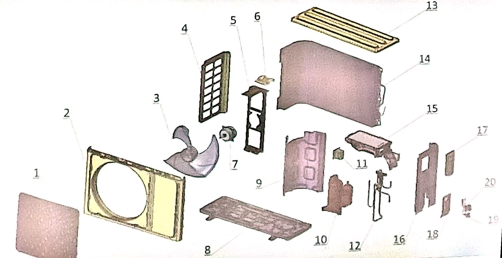

# 空调相关知识

## 空调内机爆炸图

|1、面板|2、装饰条|3、过滤网|
|:-|:-|:-|
|4、显示灯板|5、显示灯板|6、中框左端盖|
|7、WIFF|8、中框接线盖|9、导风门|
|10、导风门插销|11、中框|12、手指护网|
|13、叶片|14、电机座|15、电机|
|16、连杆|17、左支架|18、轴承座|
|19、贯流风叶|20、底座|21、蒸发器组件|
|22、右支架|23、电机压板|24、挂板|
|25、压盖支撑板|26、室内电机|27、电机座|
|28、管路压攀|29、过线板|30、负离子|
|31、步进电机|32、底座窝舌|33、连杆|
|34、中框右端盖|35、变压器|36、控制器上盖|
|37、电控盒盖衬|38、压线抱攀|39、端子板|
|40、主控制板|41、感温包探头|42、电控盒|
|43、电控盒屏蔽盒1|44、电控盒屏蔽盒2|45、塑料挡片|

## 空调外机爆炸图

|1、面板网罩|2、面板|3、轴流风叶|
|:-|:-|:-|
|4、左侧板|5、电机架|6、电机架挂耳|
|7、室外电机|8、底盘组件|9、隔风立板|
|10、压缩机|11、电抗器|12、配管组件|
|13、顶盖板|14、冷凝器总成|15、控制器|
|16、右侧板|17、电器盖板|18、阀板|
|19、高压截止阀|20、低压截止阀||